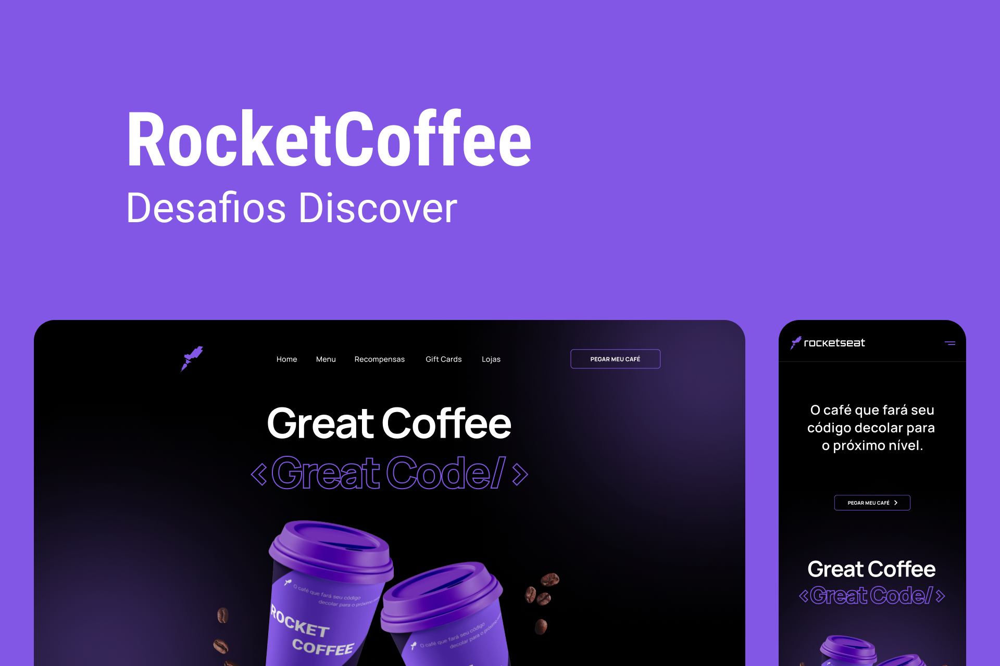
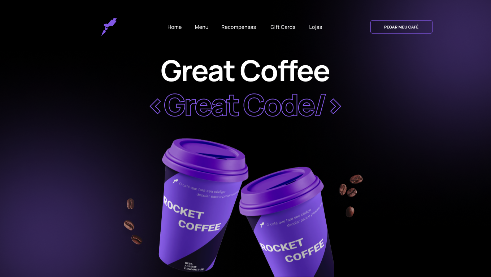

# Desafio: RocketCoffee



## **Índice**

# 💻 Sobre o desafio

---

Neste desafio você deverá desenvolver uma homepage para uma marca de café.

## Layout



Você pode visualizar o template do projeto clicando [neste link](https://www.figma.com/file/tFoovGllUttTebdUTDVdT8/RocketCoffee/duplicate) e zip com os assets exportados.

Baixe os assets aqui ⤵️

[assets.zip](desafio/assets.zip)

# 🚀 **Techs**

---

- HTML
- CSS
- JavaScript

# ✅ **Requisitos**

---

Neste desafio você vai construir uma homepage para uma marca de café*.* Caso você ainda não tenha feito os cursos do Discover ou queira fazer uma revisão, segue abaixo uma lista dos cursos e documentações que podem te ajudar a resolver este desafio.

- [O guia estelar de HTML](https://app.rocketseat.com.br/node/o-guia-estelar-de-html)
- [O guia estelar de CSS](https://app.rocketseat.com.br/node/o-guia-estelar-de-css)
- [Posicionando foguetes](https://app.rocketseat.com.br/node/posicionando-foguetes)
- [Formulários de outro planeta](https://app.rocketseat.com.br/node/formularios-de-outro-planeta)
- [Alinhando os planetas](https://app.rocketseat.com.br/node/flexbox)
- [App bonito, até nos textos](https://app.rocketseat.com.br/node/flexbox)
- [O Guia Estelar de JavaScript](https://app.rocketseat.com.br/node/o-guia-estelar-de-java-script)
- [Pilotando com a DOM](https://app.rocketseat.com.br/node/pilotando-com-a-dom)

**Requisitos para o desafio:**

- Seguir o layout do Figma.
- Deixar o layout responsivo conforme o Figma.
- Na versão mobile, ao clicar no menu hamburger deverá exibir um menu responsivo conforme layout do Figma.
- Adicionar `hover` nos botões.

**Dica:**

- Para criar o stroke do título `<Great Code />` utilize a seguinte estilização:
  ```css
  text-shadow: -1px -1px 0 var(--button), 1px -1px 0 var(--button),
    -1px 1px 0 var(--button), 1px 1px 0 var(--button);
  ```

**_Se desafie também:_**

- Adicionando animações

# 🎨 Style Guide

---

## **Cores:**

```css
:root {
  --backgrond: #000;
  --text-color: #fff;
  --button: #8257e5;
  --border: #29292e;
  --border-menu-mobile: #a8a8b3;
  --text-color-menu-mobile: #e1e1e6;
}
```

## **Tipo de fonte:**

font-family: Manrope

font-weight: 400 e 700

Você pode encontrar a fonte no [Google Fonts](https://fonts.google.com/)
